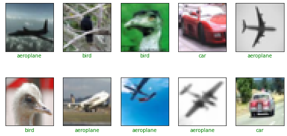
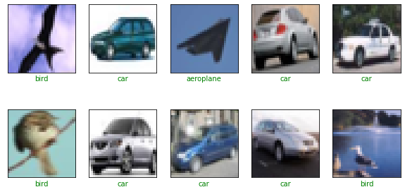
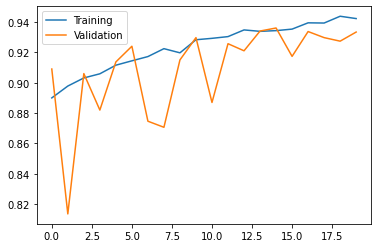
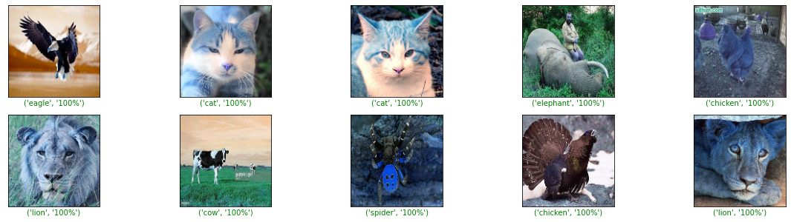

# Image Classification with CNN using Keras

# Task 1: Import Libraries


```python
!pip install tensorflow
```

    Collecting tensorflow
      Downloading tensorflow-2.8.0-cp39-cp39-win_amd64.whl (438.0 MB)
    Collecting keras-preprocessing>=1.1.1
      Downloading Keras_Preprocessing-1.1.2-py2.py3-none-any.whl (42 kB)
    Requirement already satisfied: h5py>=2.9.0 in c:\programdata\anaconda3\lib\site-packages (from tensorflow) (3.2.1)
    Collecting gast>=0.2.1
      Downloading gast-0.5.3-py3-none-any.whl (19 kB)
    Requirement already satisfied: setuptools in c:\programdata\anaconda3\lib\site-packages (from tensorflow) (58.0.4)
    Collecting tensorboard<2.9,>=2.8
      Downloading tensorboard-2.8.0-py3-none-any.whl (5.8 MB)
    Collecting astunparse>=1.6.0
      Downloading astunparse-1.6.3-py2.py3-none-any.whl (12 kB)
    Collecting flatbuffers>=1.12
      Downloading flatbuffers-2.0-py2.py3-none-any.whl (26 kB)
    Collecting libclang>=9.0.1
      Downloading libclang-13.0.0-py2.py3-none-win_amd64.whl (13.9 MB)
    Collecting google-pasta>=0.1.1
      Downloading google_pasta-0.2.0-py3-none-any.whl (57 kB)
    Collecting opt-einsum>=2.3.2
      Downloading opt_einsum-3.3.0-py3-none-any.whl (65 kB)
    Collecting tf-estimator-nightly==2.8.0.dev2021122109
      Downloading tf_estimator_nightly-2.8.0.dev2021122109-py2.py3-none-any.whl (462 kB)
    Collecting protobuf>=3.9.2
      Downloading protobuf-3.20.0-cp39-cp39-win_amd64.whl (904 kB)
    Collecting grpcio<2.0,>=1.24.3
      Downloading grpcio-1.44.0-cp39-cp39-win_amd64.whl (3.4 MB)
    Collecting tensorflow-io-gcs-filesystem>=0.23.1
      Downloading tensorflow_io_gcs_filesystem-0.24.0-cp39-cp39-win_amd64.whl (1.5 MB)
    Requirement already satisfied: typing-extensions>=3.6.6 in c:\programdata\anaconda3\lib\site-packages (from tensorflow) (3.10.0.2)
    Collecting termcolor>=1.1.0
      Downloading termcolor-1.1.0.tar.gz (3.9 kB)
    Collecting absl-py>=0.4.0
      Downloading absl_py-1.0.0-py3-none-any.whl (126 kB)
    Requirement already satisfied: numpy>=1.20 in c:\programdata\anaconda3\lib\site-packages (from tensorflow) (1.20.3)
    Collecting keras<2.9,>=2.8.0rc0
      Downloading keras-2.8.0-py2.py3-none-any.whl (1.4 MB)
    Requirement already satisfied: wrapt>=1.11.0 in c:\programdata\anaconda3\lib\site-packages (from tensorflow) (1.12.1)
    Requirement already satisfied: six>=1.12.0 in c:\programdata\anaconda3\lib\site-packages (from tensorflow) (1.16.0)
    Requirement already satisfied: wheel<1.0,>=0.23.0 in c:\programdata\anaconda3\lib\site-packages (from astunparse>=1.6.0->tensorflow) (0.37.0)
    Requirement already satisfied: requests<3,>=2.21.0 in c:\programdata\anaconda3\lib\site-packages (from tensorboard<2.9,>=2.8->tensorflow) (2.26.0)
    Collecting tensorboard-data-server<0.7.0,>=0.6.0
      Downloading tensorboard_data_server-0.6.1-py3-none-any.whl (2.4 kB)
    Collecting tensorboard-plugin-wit>=1.6.0
      Downloading tensorboard_plugin_wit-1.8.1-py3-none-any.whl (781 kB)
    Requirement already satisfied: werkzeug>=0.11.15 in c:\programdata\anaconda3\lib\site-packages (from tensorboard<2.9,>=2.8->tensorflow) (2.0.2)
    Collecting google-auth<3,>=1.6.3
      Downloading google_auth-2.6.5-py2.py3-none-any.whl (156 kB)
    Collecting markdown>=2.6.8
      Downloading Markdown-3.3.6-py3-none-any.whl (97 kB)
    Collecting google-auth-oauthlib<0.5,>=0.4.1
      Downloading google_auth_oauthlib-0.4.6-py2.py3-none-any.whl (18 kB)
    Collecting rsa<5,>=3.1.4
      Downloading rsa-4.8-py3-none-any.whl (39 kB)
    Collecting cachetools<6.0,>=2.0.0
      Downloading cachetools-5.0.0-py3-none-any.whl (9.1 kB)
    Collecting pyasn1-modules>=0.2.1
      Downloading pyasn1_modules-0.2.8-py2.py3-none-any.whl (155 kB)
    Collecting requests-oauthlib>=0.7.0
      Downloading requests_oauthlib-1.3.1-py2.py3-none-any.whl (23 kB)
    Requirement already satisfied: importlib-metadata>=4.4 in c:\programdata\anaconda3\lib\site-packages (from markdown>=2.6.8->tensorboard<2.9,>=2.8->tensorflow) (4.8.1)
    Requirement already satisfied: zipp>=0.5 in c:\programdata\anaconda3\lib\site-packages (from importlib-metadata>=4.4->markdown>=2.6.8->tensorboard<2.9,>=2.8->tensorflow) (3.6.0)
    Collecting pyasn1<0.5.0,>=0.4.6
      Downloading pyasn1-0.4.8-py2.py3-none-any.whl (77 kB)
    Requirement already satisfied: idna<4,>=2.5 in c:\programdata\anaconda3\lib\site-packages (from requests<3,>=2.21.0->tensorboard<2.9,>=2.8->tensorflow) (3.2)
    Requirement already satisfied: charset-normalizer~=2.0.0 in c:\programdata\anaconda3\lib\site-packages (from requests<3,>=2.21.0->tensorboard<2.9,>=2.8->tensorflow) (2.0.4)
    Requirement already satisfied: certifi>=2017.4.17 in c:\programdata\anaconda3\lib\site-packages (from requests<3,>=2.21.0->tensorboard<2.9,>=2.8->tensorflow) (2021.10.8)
    Requirement already satisfied: urllib3<1.27,>=1.21.1 in c:\programdata\anaconda3\lib\site-packages (from requests<3,>=2.21.0->tensorboard<2.9,>=2.8->tensorflow) (1.26.7)
    Collecting oauthlib>=3.0.0
      Downloading oauthlib-3.2.0-py3-none-any.whl (151 kB)
    Building wheels for collected packages: termcolor
      Building wheel for termcolor (setup.py): started
      Building wheel for termcolor (setup.py): finished with status 'done'
      Created wheel for termcolor: filename=termcolor-1.1.0-py3-none-any.whl size=4847 sha256=81a81f59edef26eac33fa8d62f7cd7435ecdcc2d246f8c1a4877844b95671907
      Stored in directory: c:\users\shake\appdata\local\pip\cache\wheels\b6\0d\90\0d1bbd99855f99cb2f6c2e5ff96f8023fad8ec367695f7d72d
    Successfully built termcolor
    Installing collected packages: pyasn1, rsa, pyasn1-modules, oauthlib, cachetools, requests-oauthlib, google-auth, tensorboard-plugin-wit, tensorboard-data-server, protobuf, markdown, grpcio, google-auth-oauthlib, absl-py, tf-estimator-nightly, termcolor, tensorflow-io-gcs-filesystem, tensorboard, opt-einsum, libclang, keras-preprocessing, keras, google-pasta, gast, flatbuffers, astunparse, tensorflow
    Successfully installed absl-py-1.0.0 astunparse-1.6.3 cachetools-5.0.0 flatbuffers-2.0 gast-0.5.3 google-auth-2.6.5 google-auth-oauthlib-0.4.6 google-pasta-0.2.0 grpcio-1.44.0 keras-2.8.0 keras-preprocessing-1.1.2 libclang-13.0.0 markdown-3.3.6 oauthlib-3.2.0 opt-einsum-3.3.0 protobuf-3.20.0 pyasn1-0.4.8 pyasn1-modules-0.2.8 requests-oauthlib-1.3.1 rsa-4.8 tensorboard-2.8.0 tensorboard-data-server-0.6.1 tensorboard-plugin-wit-1.8.1 tensorflow-2.8.0 tensorflow-io-gcs-filesystem-0.24.0 termcolor-1.1.0 tf-estimator-nightly-2.8.0.dev2021122109
    


```python
import tensorflow as tf
import os
import numpy as np

from matplotlib import pyplot as plt
%matplotlib inline

if not os.path.isdir('models'):
    os.mkdir('models')
    
print('TensorFlow version:', tf.__version__)
print('Is using GPU?', tf.test.is_gpu_available())
```

    TensorFlow version: 2.8.0
    Is using GPU? False
    

# Task 2: Preprocess Data


```python
def get_three_classes(x, y):
    indices_0, _ = np.where(y == 0.)
    indices_1, _ = np.where(y == 1.)
    indices_2, _ = np.where(y == 2.)

    indices = np.concatenate([indices_0, indices_1, indices_2], axis=0)
    
    x = x[indices]
    y = y[indices]
    
    count = x.shape[0]
    indices = np.random.choice(range(count), count, replace=False)
    
    x = x[indices]
    y = y[indices]
    
    y = tf.keras.utils.to_categorical(y)
    
    return x, y
```


```python
(x_train, y_train), (x_test, y_test) = tf.keras.datasets.cifar10.load_data()
print("Train whole set:")
print(x_train.shape, y_train.shape)
print("Test whole set:")
print(x_test.shape, y_test.shape)

x_train, y_train = get_three_classes(x_train, y_train)
x_test, y_test = get_three_classes(x_test, y_test)
print("Train subset:")
print(x_train.shape, y_train.shape)
print("Test subset:")
print(x_test.shape, y_test.shape)
```

    Downloading data from https://www.cs.toronto.edu/~kriz/cifar-10-python.tar.gz
    170500096/170498071 [==============================] - 415s 2us/step
    170508288/170498071 [==============================] - 415s 2us/step
    Train whole set:
    (50000, 32, 32, 3) (50000, 1)
    Test whole set:
    (10000, 32, 32, 3) (10000, 1)
    Train subset:
    (15000, 32, 32, 3) (15000, 3)
    Test subset:
    (3000, 32, 32, 3) (3000, 3)
    

# Task 3: Visualize Examples


```python
class_names = ['aeroplane', 'car', 'bird']

def show_random_examples(x, y, p):
    indices = np.random.choice(range(x.shape[0]), 10, replace=False)
    
    x = x[indices]
    y = y[indices]
    p = p[indices]
    
    plt.figure(figsize=(10, 5))
    for i in range(10):
        plt.subplot(2, 5, 1 + i)
        plt.imshow(x[i])
        plt.xticks([])
        plt.yticks([])
        col = 'green' if np.argmax(y[i]) == np.argmax(p[i]) else 'red'
        plt.xlabel(class_names[np.argmax(p[i])], color=col)
    plt.show()
    
show_random_examples(x_train, y_train, y_train)
```


    

    


```python
show_random_examples(x_test, y_test, y_test)
```


    

    


# Task 4: Create Model


```python
from tensorflow.keras.layers import Conv2D, MaxPooling2D, BatchNormalization
from tensorflow.keras.layers import Dropout, Flatten, Input, Dense

def create_model():
    def add_conv_block(model, num_filters):
        model.add(Conv2D(num_filters, 3, activation='relu', padding='same'))
        model.add(BatchNormalization())
        model.add(Conv2D(num_filters, 3, activation='relu'))
        model.add(MaxPooling2D(pool_size=2))
        model.add(Dropout(0.5))
        return model

    model = tf.keras.models.Sequential()
    model.add(Input(shape=(32, 32,3)))
    
    model = add_conv_block(model, 32)
    model = add_conv_block(model, 64)
    model = add_conv_block(model, 128)
    
    model.add(Flatten())
    model.add(Dense(3, activation='softmax'))
    
    model.compile(
        loss='categorical_crossentropy',
        optimizer='adam', metrics=['accuracy']
    )
    return model

model = create_model()
model.summary()
```

    Model: "sequential"
    _________________________________________________________________
     Layer (type)                Output Shape              Param #   
    =================================================================
     conv2d (Conv2D)             (None, 32, 32, 32)        896       
                                                                     
     batch_normalization (BatchN  (None, 32, 32, 32)       128       
     ormalization)                                                   
                                                                     
     conv2d_1 (Conv2D)           (None, 30, 30, 32)        9248      
                                                                     
     max_pooling2d (MaxPooling2D  (None, 15, 15, 32)       0         
     )                                                               
                                                                     
     dropout (Dropout)           (None, 15, 15, 32)        0         
                                                                     
     conv2d_2 (Conv2D)           (None, 15, 15, 64)        18496     
                                                                     
     batch_normalization_1 (Batc  (None, 15, 15, 64)       256       
     hNormalization)                                                 
                                                                     
     conv2d_3 (Conv2D)           (None, 13, 13, 64)        36928     
                                                                     
     max_pooling2d_1 (MaxPooling  (None, 6, 6, 64)         0         
     2D)                                                             
                                                                     
     dropout_1 (Dropout)         (None, 6, 6, 64)          0         
                                                                     
     conv2d_4 (Conv2D)           (None, 6, 6, 128)         73856     
                                                                     
     batch_normalization_2 (Batc  (None, 6, 6, 128)        512       
     hNormalization)                                                 
                                                                     
     conv2d_5 (Conv2D)           (None, 4, 4, 128)         147584    
                                                                     
     max_pooling2d_2 (MaxPooling  (None, 2, 2, 128)        0         
     2D)                                                             
                                                                     
     dropout_2 (Dropout)         (None, 2, 2, 128)         0         
                                                                     
     flatten (Flatten)           (None, 512)               0         
                                                                     
     dense (Dense)               (None, 3)                 1539      
                                                                     
    =================================================================
    Total params: 289,443
    Trainable params: 288,995
    Non-trainable params: 448
    _________________________________________________________________
    

# Task 5: Train the Model


```python
h = model.fit(
    x_train/255., y_train,
    validation_data=(x_test/255., y_test),
    epochs=20, batch_size=64,
    callbacks=[
        tf.keras.callbacks.EarlyStopping(monitor='val_accuracy', patience=5),
        tf.keras.callbacks.ModelCheckpoint(
            'models/model_{val_accuracy:.3f}.h5',
            save_best_only=True, save_weights_only=False,
            monitor='val_accuracy'
        )
    ]
)
```

    Epoch 1/20
    235/235 [==============================] - 21s 90ms/step - loss: 0.2868 - accuracy: 0.8900 - val_loss: 0.2514 - val_accuracy: 0.9090
    Epoch 2/20
    235/235 [==============================] - 21s 89ms/step - loss: 0.2700 - accuracy: 0.8978 - val_loss: 0.6099 - val_accuracy: 0.8137
    Epoch 3/20
    235/235 [==============================] - 21s 88ms/step - loss: 0.2534 - accuracy: 0.9031 - val_loss: 0.2670 - val_accuracy: 0.9060
    Epoch 4/20
    235/235 [==============================] - 21s 88ms/step - loss: 0.2441 - accuracy: 0.9059 - val_loss: 0.3108 - val_accuracy: 0.8820
    Epoch 5/20
    235/235 [==============================] - 21s 88ms/step - loss: 0.2371 - accuracy: 0.9115 - val_loss: 0.2478 - val_accuracy: 0.9137
    Epoch 6/20
    235/235 [==============================] - 21s 88ms/step - loss: 0.2228 - accuracy: 0.9144 - val_loss: 0.2014 - val_accuracy: 0.9240
    Epoch 7/20
    235/235 [==============================] - 21s 88ms/step - loss: 0.2144 - accuracy: 0.9172 - val_loss: 0.3750 - val_accuracy: 0.8747
    Epoch 8/20
    235/235 [==============================] - 21s 88ms/step - loss: 0.2089 - accuracy: 0.9224 - val_loss: 0.3351 - val_accuracy: 0.8707
    Epoch 9/20
    235/235 [==============================] - 21s 88ms/step - loss: 0.2082 - accuracy: 0.9197 - val_loss: 0.2159 - val_accuracy: 0.9150
    Epoch 10/20
    235/235 [==============================] - 21s 88ms/step - loss: 0.1913 - accuracy: 0.9283 - val_loss: 0.2120 - val_accuracy: 0.9297
    Epoch 11/20
    235/235 [==============================] - 21s 87ms/step - loss: 0.1879 - accuracy: 0.9292 - val_loss: 0.3387 - val_accuracy: 0.8870
    Epoch 12/20
    235/235 [==============================] - 21s 88ms/step - loss: 0.1843 - accuracy: 0.9303 - val_loss: 0.1869 - val_accuracy: 0.9257
    Epoch 13/20
    235/235 [==============================] - 21s 89ms/step - loss: 0.1764 - accuracy: 0.9347 - val_loss: 0.2107 - val_accuracy: 0.9210
    Epoch 14/20
    235/235 [==============================] - 20s 87ms/step - loss: 0.1751 - accuracy: 0.9338 - val_loss: 0.1792 - val_accuracy: 0.9340
    Epoch 15/20
    235/235 [==============================] - 20s 87ms/step - loss: 0.1727 - accuracy: 0.9343 - val_loss: 0.1792 - val_accuracy: 0.9360
    Epoch 16/20
    235/235 [==============================] - 20s 87ms/step - loss: 0.1650 - accuracy: 0.9353 - val_loss: 0.2351 - val_accuracy: 0.9173
    Epoch 17/20
    235/235 [==============================] - 20s 87ms/step - loss: 0.1594 - accuracy: 0.9394 - val_loss: 0.1770 - val_accuracy: 0.9337
    Epoch 18/20
    235/235 [==============================] - 20s 86ms/step - loss: 0.1582 - accuracy: 0.9393 - val_loss: 0.1861 - val_accuracy: 0.9297
    Epoch 19/20
    235/235 [==============================] - 20s 86ms/step - loss: 0.1504 - accuracy: 0.9437 - val_loss: 0.1990 - val_accuracy: 0.9273
    Epoch 20/20
    235/235 [==============================] - 21s 87ms/step - loss: 0.1521 - accuracy: 0.9422 - val_loss: 0.1856 - val_accuracy: 0.9333
    

# Task 6: Final Predictions


```python
accs = h.history['accuracy']
val_accs = h.history['val_accuracy']

plt.plot(range(len(accs)), accs, label='Training')
plt.plot(range(len(accs)), val_accs, label='Validation')
plt.legend()
plt.show()
```


    

    


```python
model= tf.keras.models.load_model('models/model_0.936.h5')
```


```python
preds = model.predict(x_test/255.)
```


```python
show_random_examples(x_test, y_test, preds)
```


    

    


```python

```
