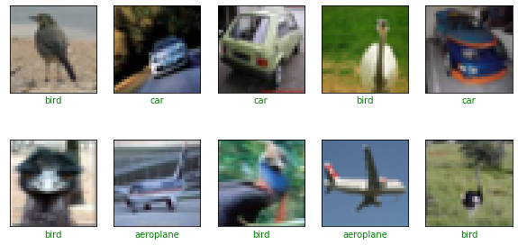

# Image Search Engine with CNN using Keras

# Task 1: Import Libraries


```python
import tensorflow as tf
import os
os.environ["CUDA_VISIBLE_DEVICES"] = "-1"
import pandas as pd
import numpy as np
from keras.models import Sequential
from keras.layers import Convolution2D,BatchNormalization
from keras.layers import MaxPooling2D,Dropout
from keras.layers import Flatten
from keras.layers import Dense
import cv2
from sklearn.preprocessing import LabelBinarizer
from sklearn.model_selection import train_test_split

from keras.preprocessing.image import img_to_array
import random
from keras.preprocessing import image

from matplotlib import pyplot as plt
%matplotlib inline

if not os.path.isdir('models'):
    os.mkdir('models')
    
print('TensorFlow version:', tf.__version__)
print('Is using GPU?', False if tf.config.list_physical_devices('GPU') == [] else True)
print("Num GPUs Available: ", len(tf.config.list_physical_devices('GPU')))
# print(tf.config.list_physical_devices('GPU'))
```

    TensorFlow version: 2.8.0
    Is using GPU? False
    Num GPUs Available:  0
    

# Importing Dataset


```python
class Dataset(object):
    def __init__(self, data_path):
        self.data_path = data_path
        assert os.path.exists(self.data_path), 'Insert a valid path!'

        # get class list
        self.data_classes = os.listdir(self.data_path)

        # init mapping dict
        self.data_mapping = {}

        # populate mapping dict
        for c, c_name in enumerate(self.data_classes):
            temp_path = os.path.join(self.data_path, c_name)
            temp_images = os.listdir(temp_path)

            for i in temp_images:
                img_tmp = os.path.join(temp_path, i)

                if img_tmp.lower().endswith(('.jpg', '.jpeg')):
                    if c_name == 'distractor':
                        self.data_mapping[img_tmp] = -1
                    else:
                        self.data_mapping[img_tmp] = c_name

        print('Loaded {:d} from {:s} images'.format(len(self.data_mapping.keys()),
                                                    self.data_path))

    def get_data_paths(self):
        # returns a list of imgpaths and related classes
        images = []
        classes = []
        for img_path in self.data_mapping.keys():
            if img_path.lower().endswith(('.jpg', '.jpeg')):
                images.append(img_path)
                classes.append(self.data_mapping[img_path])
        return images, np.array(classes)


    def num_classes(self):
        # returns number of classes of the dataset
        return len(self.data_classes)
```

# Task 2: Preprocess Data


```python
# we get data_path
# data_path = '/content/drive/MyDrive/ML/dataset'
data_path = 'dataset_rahin'
# we define training_path
training_path = os.path.join(data_path, 'training')

# we define validation path, query and gallery
validation_path = os.path.join(data_path, 'validation')
gallery_path = os.path.join(validation_path, 'gallery')
query_path = os.path.join(validation_path, 'query')
```


```python
training_dataset = Dataset(data_path=training_path)
gallery_dataset = Dataset(data_path=gallery_path)
query_dataset = Dataset(data_path=query_path)
```

    Loaded 47986 from dataset_rahin\training images
    Loaded 295 from dataset_rahin\validation\gallery images
    Loaded 26 from dataset_rahin\validation\query images
    


```python
"""Importing the data folder and giving a shuffle"""
dataset=[]
labels=[]
random.seed(421)
# print("Before sort:")
# print(imagePaths)
# print()
# print()
# print()
imagePaths = sorted(list(os.listdir("dataset_rahin/training")))
print("After sort:")
print(imagePaths)
print()
print()
print()
class_names = imagePaths
# random.shuffle(imagePaths)
print("After randomize:")
print(imagePaths)
print()
print()
print()

class_names_random = imagePaths
```

    After sort:
    ['antelope', 'axolotl', 'badger', 'bat', 'bear', 'bee', 'beetle', 'bison', 'boar', 'butterfly', 'cat', 'caterpillar', 'cheetah', 'chicken', 'chimpanzee', 'cockroach', 'cow', 'coyote', 'crab', 'crow', 'deer', 'dog', 'dolphin', 'donkey', 'dragonfly', 'duck', 'eagle', 'elephant', 'flamingo', 'fly', 'fox', 'frog', 'goat', 'goldfish', 'goose', 'gorilla', 'grasshopper', 'hamster', 'hare', 'hedgehog', 'hippopotamus', 'hornbill', 'horse', 'hummingbird', 'hyena', 'jellyfish', 'kangaroo', 'koala', 'ladybugs', 'leopard', 'lion', 'lizard', 'lobster', 'mosquito', 'moth', 'mouse', 'octopus', 'okapi', 'orangutan', 'ostrich', 'otter', 'owl', 'ox', 'oyster', 'panda', 'parrot', 'peacock', 'pelecaniformes', 'penguin', 'pig', 'pigeon', 'porcupine', 'possum', 'raccoon', 'rat', 'reindeer', 'rhinoceros', 'sandpiper', 'seahorse', 'seal', 'shark', 'sheep', 'snail', 'snake', 'sparrow', 'spider', 'squid', 'squirrel', 'starfish', 'swan', 'tiger', 'turkey', 'turtle', 'whale', 'wolf', 'wombat', 'woodpecker', 'zebra']
    
    
    
    After randomize:
    ['antelope', 'axolotl', 'badger', 'bat', 'bear', 'bee', 'beetle', 'bison', 'boar', 'butterfly', 'cat', 'caterpillar', 'cheetah', 'chicken', 'chimpanzee', 'cockroach', 'cow', 'coyote', 'crab', 'crow', 'deer', 'dog', 'dolphin', 'donkey', 'dragonfly', 'duck', 'eagle', 'elephant', 'flamingo', 'fly', 'fox', 'frog', 'goat', 'goldfish', 'goose', 'gorilla', 'grasshopper', 'hamster', 'hare', 'hedgehog', 'hippopotamus', 'hornbill', 'horse', 'hummingbird', 'hyena', 'jellyfish', 'kangaroo', 'koala', 'ladybugs', 'leopard', 'lion', 'lizard', 'lobster', 'mosquito', 'moth', 'mouse', 'octopus', 'okapi', 'orangutan', 'ostrich', 'otter', 'owl', 'ox', 'oyster', 'panda', 'parrot', 'peacock', 'pelecaniformes', 'penguin', 'pig', 'pigeon', 'porcupine', 'possum', 'raccoon', 'rat', 'reindeer', 'rhinoceros', 'sandpiper', 'seahorse', 'seal', 'shark', 'sheep', 'snail', 'snake', 'sparrow', 'spider', 'squid', 'squirrel', 'starfish', 'swan', 'tiger', 'turkey', 'turtle', 'whale', 'wolf', 'wombat', 'woodpecker', 'zebra']
    
    
    
    


```python
for images in imagePaths:
    path=sorted(list(os.listdir("dataset_rahin/training/"+images)))
    for i in path:
        try:
            image = cv2.imread("dataset_rahin/training/"+images+'/'+i) #using opencv to read image
#             print(images, ": ", i, ": ", image.shape)
#             image=cv2.cvtColor(image, cv2.COLOR_BGR2GRAY)
            image = cv2.resize(image, (128,128)) 
#             image = img_to_array(image) #converting image info to array
            dataset.append(image)

            l = label = images
            labels.append(l)
#             print(l)
        except:
            print("Error with loading and resizing image", " ", images, ": ", i)
            #code to move to next frame
```


```python
"""Converting to numpay array"""
dataset = np.array(dataset, dtype="float32") / 255.0
original_labels = np.array(labels)

"""Here we are using LabelBinarizer to scale data because it does not need data in integer encoded form first to convert into its respective encoding"""
lb = LabelBinarizer()
labels = lb.fit_transform(original_labels)
```


```python
"""Splitting dataset into train and test"""

x_train,x_test,y_train,y_test=train_test_split(dataset,labels,test_size=0.3,random_state=421)
```


```python
# print(y_train)
```


```python
# y_test = tf.keras.utils.to_categorical(y_test)
```


```python
# y_train = tf.keras.utils.to_categorical(y_train)
# y_train2 = tf.keras.utils.to_categorical(np.asarray(y_train.factorize()[0]))
```


```python
# def get_three_classes(x, y):
#     indices_0, _ = np.where(y == 0.)
#     indices_1, _ = np.where(y == 1.)
#     indices_2, _ = np.where(y == 2.)

#     indices = np.concatenate([indices_0, indices_1, indices_2], axis=0)
    
#     x = x[indices]
#     y = y[indices]
    
#     count = x.shape[0]
#     indices = np.random.choice(range(count), count, replace=False)
    
#     x = x[indices]
#     y = y[indices]
    
#     y = tf.keras.utils.to_categorical(y)
    
#     return x, y
```


```python
# (x_train, y_train), (x_test, y_test) = tf.keras.datasets.cifar10.load_data()
print("Train whole set:")
print(x_train.shape, y_train.shape)
print("Test whole set:")
print(x_test.shape, y_test.shape)

# x_train2, y_train2 = get_three_classes(x_train, y_train)
# x_test2, y_test2 = get_three_classes(x_test, y_test)
# print("Train subset:")
# print(x_train2.shape, y_train2.shape)
# print("Test subset:")
# print(x_test2.shape, y_test2.shape)
```

    Train whole set:
    (33625, 128, 128, 3) (33625, 98)
    Test whole set:
    (14412, 128, 128, 3) (14412, 98)
    

# Task 3: Visualize Examples


```python
# class_names = ['aeroplane', 'car', 'bird']

def show_random_examples(x, y, p):
    indices = np.random.choice(range(x.shape[0]), 10, replace=False)
    
    x = x[indices]
    y = y[indices]
    p = p[indices]
    
    plt.figure(figsize=(20, 5))
    for i in range(10):
        plt.subplot(2, 5, 1 + i)
        plt.imshow(x[i])
        plt.xticks([])
        plt.yticks([])
        col = 'green' if np.argmax(y[i]) == np.argmax(p[i]) else 'red'
#         sblabel = i, "pc:"+str(np.argmax(p[i])), "p:"+str(max(p[i])*100)+"%", "tc:"+str(np.argmax(y[i]))
#         sblabel = "pc:"+class_names[np.argmax(p[i])], "p:"+str(max(p[i])*100)+"%", "tc:"+class_names[np.argmax(y[i])]
        sblabel = class_names[np.argmax(p[i])], str(max(p[i])*100)+"%"
        plt.xlabel(sblabel, color=col)
#         print(class_names_random)
#         print(np.argmax(p[i]))
    plt.show()
    
show_random_examples(x_train, y_train, y_train)
```


    

    


```python
show_random_examples(x_test, y_test, y_test)
```


    

    


```python
def show_similar_images(x, y, p, specific_class):
#     indices = np.random.choice(range(x.shape[0]), 10, replace=False)
    
#     x = x[indices]
#     y = y[indices]
#     p = p[indices]
    
    plt.figure(figsize=(20, 5))
    for i in range(10):
        plt.subplot(2, 5, 1 + i)
        plt.imshow(x[i])
        plt.xticks([])
        plt.yticks([])
        col = 'green' if np.argmax(y[i]) == np.argmax(p[i]) else 'red'
        sblabel = i, "pc:"+str(np.argmax(p[i])), "p:"+str(max(p[i])*100)+"%", "tc:"+str(np.argmax(y[i]))
        plt.xlabel(sblabel, color=col)
    plt.show()
    
show_random_examples(x_train, y_train, y_train)
```


    

    


```python
print(np.argmax(y_train[0]))
```

    21
    

# Task 4: Create Model


```python
from tensorflow.keras.layers import Conv2D, MaxPooling2D, BatchNormalization
from tensorflow.keras.layers import Dropout, Flatten, Input, Dense

def create_model():
    def add_conv_block(model, num_filters):
        model.add(Conv2D(num_filters, 3, activation='relu', padding='same'))
        model.add(BatchNormalization())
        model.add(Conv2D(num_filters, 3, activation='relu'))
        model.add(MaxPooling2D(pool_size=2))
#         model.add(Dropout(0.5))
        return model

    model = tf.keras.models.Sequential()
    model.add(Input(shape=(128, 128,3)))
    
    model = add_conv_block(model, 32)
    model = add_conv_block(model, 64)
    model = add_conv_block(model, 128)
    
    model.add(Flatten())
    model.add(Dense(98, activation='softmax'))
    
    model.compile(
        loss='categorical_crossentropy',
        optimizer='adam', metrics=['accuracy']
    )
    return model

model = create_model()
model.summary()
```

    Model: "sequential"
    _________________________________________________________________
     Layer (type)                Output Shape              Param #   
    =================================================================
     conv2d (Conv2D)             (None, 128, 128, 32)      896       
                                                                     
     batch_normalization (BatchN  (None, 128, 128, 32)     128       
     ormalization)                                                   
                                                                     
     conv2d_1 (Conv2D)           (None, 126, 126, 32)      9248      
                                                                     
     max_pooling2d (MaxPooling2D  (None, 63, 63, 32)       0         
     )                                                               
                                                                     
     conv2d_2 (Conv2D)           (None, 63, 63, 64)        18496     
                                                                     
     batch_normalization_1 (Batc  (None, 63, 63, 64)       256       
     hNormalization)                                                 
                                                                     
     conv2d_3 (Conv2D)           (None, 61, 61, 64)        36928     
                                                                     
     max_pooling2d_1 (MaxPooling  (None, 30, 30, 64)       0         
     2D)                                                             
                                                                     
     conv2d_4 (Conv2D)           (None, 30, 30, 128)       73856     
                                                                     
     batch_normalization_2 (Batc  (None, 30, 30, 128)      512       
     hNormalization)                                                 
                                                                     
     conv2d_5 (Conv2D)           (None, 28, 28, 128)       147584    
                                                                     
     max_pooling2d_2 (MaxPooling  (None, 14, 14, 128)      0         
     2D)                                                             
                                                                     
     flatten (Flatten)           (None, 25088)             0         
                                                                     
     dense (Dense)               (None, 98)                2458722   
                                                                     
    =================================================================
    Total params: 2,746,626
    Trainable params: 2,746,178
    Non-trainable params: 448
    _________________________________________________________________
    

# Task 5: Train the Model


```python
h = model.fit(
    x_train/255., y_train,
    validation_data=(x_test/255., y_test),
    epochs=10, batch_size=128,
    callbacks=[
        tf.keras.callbacks.EarlyStopping(monitor='val_accuracy', patience=3),
        tf.keras.callbacks.ModelCheckpoint(
            'models/model_{val_accuracy:.3f}.h5',
            save_best_only=True, save_weights_only=False,
            monitor='val_accuracy'
        )
    ]
)
```

    Epoch 1/10
    263/263 [==============================] - 641s 2s/step - loss: 2.2073 - accuracy: 0.4365 - val_loss: 4.5776 - val_accuracy: 0.0971
    Epoch 2/10
    263/263 [==============================] - 629s 2s/step - loss: 1.3388 - accuracy: 0.6413 - val_loss: 3.9060 - val_accuracy: 0.0833
    Epoch 3/10
    263/263 [==============================] - 636s 2s/step - loss: 0.8090 - accuracy: 0.7580 - val_loss: 1.6845 - val_accuracy: 0.5693
    Epoch 4/10
    263/263 [==============================] - 636s 2s/step - loss: 0.4727 - accuracy: 0.8495 - val_loss: 1.7868 - val_accuracy: 0.6057
    Epoch 5/10
    263/263 [==============================] - 635s 2s/step - loss: 0.2809 - accuracy: 0.9064 - val_loss: 2.1881 - val_accuracy: 0.6429
    Epoch 6/10
    263/263 [==============================] - 638s 2s/step - loss: 0.1567 - accuracy: 0.9484 - val_loss: 2.3991 - val_accuracy: 0.6466
    Epoch 7/10
    263/263 [==============================] - 689s 3s/step - loss: 0.0971 - accuracy: 0.9693 - val_loss: 2.1281 - val_accuracy: 0.6459
    Epoch 8/10
    263/263 [==============================] - 673s 3s/step - loss: 0.0621 - accuracy: 0.9806 - val_loss: 2.6158 - val_accuracy: 0.6770
    Epoch 9/10
    263/263 [==============================] - 656s 2s/step - loss: 0.0471 - accuracy: 0.9860 - val_loss: 2.4200 - val_accuracy: 0.6719
    Epoch 10/10
    263/263 [==============================] - 670s 3s/step - loss: 0.0365 - accuracy: 0.9889 - val_loss: 3.6218 - val_accuracy: 0.6273
    

# Task 6: Final Predictions


```python
# accs = h.history['accuracy']
# val_accs = h.history['val_accuracy']

# plt.plot(range(len(accs)), accs, label='Training')
# plt.plot(range(len(accs)), val_accs, label='Validation')
# plt.legend()
# plt.show()

accs = h.history['accuracy']
val_accs = h.history['val_accuracy']
loss = h.history['loss']
val_loss = h.history['val_loss']

epochs_range = range(10)

plt.figure(figsize=(15, 15))
plt.subplot(2, 2, 1)
plt.plot(epochs_range, accs, label='Training Accuracy')
plt.plot(epochs_range, val_accs, label='Validation Accuracy')
plt.legend(loc='lower right')
plt.title('Training and Validation Accuracy')

plt.subplot(2, 2, 2)
plt.plot(epochs_range, loss, label='Training Loss')
plt.plot(epochs_range, val_loss, label='Validation Loss')
plt.legend(loc='upper right')
plt.title('Training and Validation Loss')
plt.show()
```


    

    


```python
model= tf.keras.models.load_model('models/model_0.677.h5')
```


```python
preds = model.predict(x_test/255.)
```


```python
# max(preds[2])
i = 0
for result in preds[10]:
    fres = format(result, '.2f')
    if float(fres)>0.0:
        print(class_names[i], fres)
    
    i+=1
# print(len(preds))
# for result in preds:
#     print(np.argmax(result), "     ", str(max(result)))
```

    butterfly 0.72
    chicken 0.01
    snail 0.01
    spider 0.17
    squirrel 0.04
    woodpecker 0.06
    


```python
type(preds)
```


    numpy.ndarray


```python
show_random_examples(x_test, y_test, preds)
show_random_examples(x_test, y_test, preds)
show_random_examples(x_test, y_test, preds)
```


    

    


    

    


    

    


```python

```
